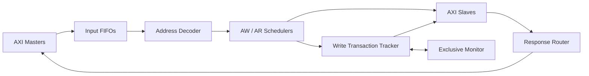

# AXI4 Full Multi-Controller

다수의 AXI4 Master와 Slave 사이에서 주소 디코딩, 요청 중재, Write transaction tracking, 응답 라우팅 및 Exclusive Access를 처리하는 SystemVerilog 기반 AXI4 Full Controller입니다.

> SystemVerilog · AXI4 Full · RTL Design · FPGA · Vivado

## Overview

<!-- 프로젝트의 목적, 해결하려는 문제, 기본 구성을 2~3문단으로 작성하세요. -->

이 프로젝트는 기존의 AXI4 custom controller가 오직 하나의 Master - Slave 간의 Transaction을 처리한다는 점이 아쉬워,      
여러 Master와 Slave를 유동적으로 처리할 수 있게 Controller를 재설계 하는 것을 목표로 합니다.       

기본 구성은 3 Master × 3 Slave이며, 내부 Controller는 Master/Slave 수, 주소·데이터·ID 폭, FIFO 깊이 및 Slave 주소 맵을 parameter로 능동적으로 구성할 수 있도록 구성했습니다.

## Key Features

- Parameterized AXI Master/Slave configuration
- Configurable Base/End address map
- Independent AW, W, AR, B, R channel buffering
- QoS, request age, burst length 기반 arbitration
- AW–W ownership 및 burst beat tracking
- B/R response routing과 Read burst locking
- Exclusive access reservation monitoring
- SystemVerilog BFM 및 scoreboard 기반 검증 환경
- Vivado IP packaging 및 FPGA implementation

## System Architecture

<!-- docs/images에 이미지를 저장한 후 아래 주석을 해제하세요. -->
<!--  -->



1. AW/AR 요청을 입력 FIFO에 저장합니다.
2. Address Decoder가 요청의 목적 Slave를 선택합니다.
3. Scheduler가 동일 Slave를 요청하는 Master 사이에서 중재합니다.
4. Write Transaction Tracker가 AW owner와 W data를 결합합니다.
5. Response Router가 B/R 응답을 원래 Master로 전달합니다.
6. Exclusive Monitor가 reservation과 overlapping write를 추적합니다.

## Design Highlights

### Parameterized Address Mapping

Slave별 Base/End 주소를 packed parameter로 전달하여 Decoder 내부의 주소 맵 하드코딩을 제거했습니다. Packed vector의 lane 0은 least-significant slice에 배치됩니다.

| Slave | Base Address | End Address |
|---|---:|---:|
| Slave 0 | `0xA000_0000` | `0xFFFF_FFFF` |
| Slave 1 | `0x4000_0000` | `0x9FFF_FFFF` |
| Slave 2 | `0x0000_0000` | `0x3FFF_FFFF` |

### QoS-aware Arbitration

동일 Slave를 요청하는 Master 사이의 우선순위는 QoS, request age, burst length를 조합한 score로 결정합니다.

```text
score =
    (QoS << QOS_SHIFT)
  + (request_age << AGE_SHIFT)
  + ((MAX_BURST_LEN - burst_len) << BURST_SHIFT)
```

Request age를 누적하여 낮은 QoS 요청의 장기 대기를 완화하고, overflow 시 score를 saturation합니다.

### Write Transaction Tracking

AXI4 W 채널에는 WID가 없으므로, 선택된 AW transaction의 Master를 저장하고 해당 Master의 W FIFO를 목적 Slave에 연결합니다. `AWLEN + 1`을 기준으로 남은 beat 수와 WLAST 위치를 추적합니다.

### Response Routing

요청이 Slave에 전달될 때 original Master와 ID를 route context에 보관합니다. B/R 응답은 저장된 context를 사용해 원래 Master로 전달하며, Read burst는 RLAST까지 동일 Slave에 lock합니다.

### Exclusive Access

Exclusive Read에서 reservation 범위를 저장하고, overlapping write가 완료되면 reservation을 무효화합니다. Matching Exclusive Write만 Slave로 전달하고 실패한 요청은 내부 응답 경로에서 처리합니다.

## Supported Features and Limitations

<!-- 실제 검증 및 지원 범위를 기준으로 표를 갱신하세요. -->

| Item | Current Support |
|---|---|
| Protocol | AXI4 Full |
| Default topology | 3 Masters × 3 Slaves |
| Address width | Parameterized, default 32-bit |
| Data width | Parameterized, default 32-bit |
| Address map | Parameterized Base/End ranges |
| QoS arbitration | Supported |
| Exclusive access | Supported |
| Clock domain | Single clock domain |
| Outstanding transactions | Limited |
| Decode error response | Not implemented |

## Verification

검증 환경은 transaction, Master/Slave BFM, scenario, monitor 및 scoreboard로 구성됩니다.

### Verification Items

- [ ] Address boundary decoding
- [ ] Concurrent requests to the same Slave
- [ ] QoS 및 aging arbitration
- [ ] Single-beat 및 burst transaction
- [ ] AW/W ownership tracking
- [ ] B/R response routing
- [ ] Random backpressure
- [ ] Exclusive access success
- [ ] Reservation invalidation by overlapping writes
- [ ] Error response propagation
- [ ] Reset behavior
- [ ] Early/missing WLAST detection

<!-- 검증 후 대표 파형과 scoreboard 결과 이미지를 추가하세요. -->
<!--  -->
<!--  -->

## Implementation Results

<!-- 재현 가능한 합성/구현 결과를 확인한 후 값을 채우세요. -->

### Configuration

| Item | Value |
|---|---:|
| FPGA device | `TODO` |
| Vivado version | `TODO` |
| Topology | `3 Masters × 3 Slaves` |
| Address/Data width | `32/32-bit` |
| FIFO depth | `TODO` |
| Target clock | `TODO MHz` |

### Timing

| Item | Result |
|---|---:|
| Clock period | `TODO ns` |
| WNS | `TODO ns` |
| TNS | `TODO ns` |
| Timing constraints | `TODO` |

### Resource Utilization

| Resource | Controller Only | Full System |
|---|---:|---:|
| LUT | `TODO` | `TODO` |
| Register | `TODO` | `TODO` |
| BRAM | `TODO` | `TODO` |
| DSP | `TODO` | `TODO` |

<!--  -->

## Repository Structure

```text
AXI4_Full_Multi_controller/
├── RTL/
│   ├── controller.sv
│   ├── controller_wrapper.sv
│   ├── decoder.sv
│   ├── scheduler.sv
│   ├── write_transaction_tracker.sv
│   ├── response_router.sv
│   ├── exclusive_monitor.sv
│   └── fifo.sv
├── TB/
│   ├── tb_controller.sv
│   ├── tb_transaction.svh
│   ├── tb_agents.svh
│   ├── tb_scoreboard.svh
│   └── tb_scenarios.svh
├── docs/
│   └── images/
└── README.md
```

| Module | Responsibility |
|---|---|
| `controller.sv` | 전체 데이터 경로와 하위 모듈 통합 |
| `controller_wrapper.sv` | 고정 3×3 Vivado IP interface wrapper |
| `decoder.sv` | Parameterized Slave 주소 선택 |
| `scheduler.sv` | AW/AR 요청 중재 |
| `write_transaction_tracker.sv` | AW–W ownership 및 beat 추적 |
| `response_router.sv` | B/R 응답 라우팅 |
| `exclusive_monitor.sv` | Exclusive reservation 추적 |
| `fifo.sv` | AXI 채널 buffering |

## Documentation

- Detailed design: `docs/design.md` (planned)
- Verification report: `docs/verification.md` (planned)
- Limitations and future work: `docs/limitations.md` (planned)

## How to Run

<!-- 실제로 재현을 확인한 Vivado 명령 또는 Tcl script를 작성하세요. -->

```text
TODO: Add reproducible simulation and synthesis commands.
```

## Future Work

- Unmapped address에 대한 local DECERR 생성
- 다중 outstanding transaction 지원 확대
- Response arbitration 정책 개선
- AXI protocol SystemVerilog Assertions 추가
- WLAST 오류 복구 정책 정의
- Exclusive access negative test 확장
