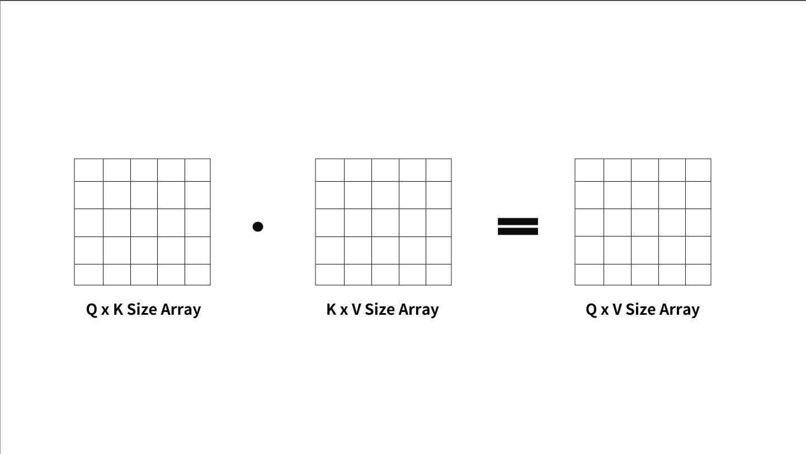
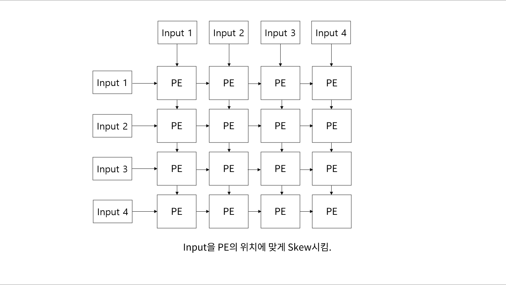
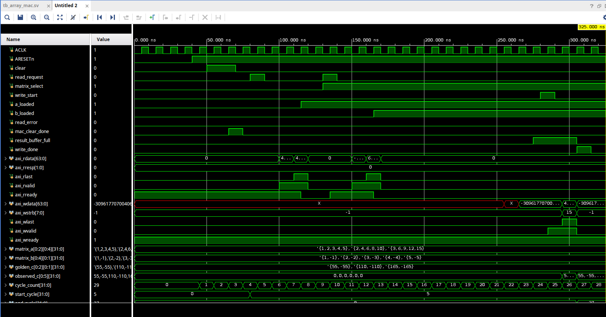

# AXI4 Full Compatiable MAC Array Calculating Device

---

## 1. 설계 개요

다수의 Master와 Slave를 연결하여 각 모듈의 데이터 처리를 지원하는 AXI4 Full Controller (가칭) 을 설계한 이후, Controller를 넘어 Master 혹은 Slave module을 직접 제작하는 것 또한 좋을 것 같다는 생각을 했었고,
제가 관심있어 하는 분야 중 하나인 인공지능 분야에서 빠질 수 없는 연산 중 하나인 행렬곱 연산기를 직접 제작하는 것을 목표로 설정하여, 직접 행렬곱 연산기를 설계하고 이를 Master Module로 만들어 실제 동작까지 구현하기로 하였습니다.

---

## 2. 행렬곱에 대한 설명

  

<em>그림 1. 행렬곱에 대한 설명</em>

행렬곱에 대해 간단하게 설명하면, 첫번째 행렬의 열 길이와, 두번째 행렬의 행 길이가 서로 같은 경우 행렬곱 사용이 가능하며, 출력 행렬의 사이즈는 첫번째 행렬의 행 길이와 두번째 행렬의 열 길이를 가진 새로운 행렬이 생성되게 됩니다.
이러한 합성곱은 Convolution 연산을 진행할 때, 원본 행렬과 Convolution Filter의 행렬곱을 통하여 출력을 생성하는데 이용되는 등 인공지능 및 머신러닝의 여러 분야에서 활용되고 있습니다.

---

## 3. MAC Array Module에 대한 설명

이번에 설계한 MAC Array 모듈은 크게 4가지로 구성되어 있습니다.
실제로 연산을 진행하는 Processing Element (PE) module의 경우, EN을 통해 해당 module의 동작을 조절하고, clear_acc를 통해 A 값과 B 값의 곱셈 결과의 누적 값인 acc 출력을 초기화 시킬 수 있습니다.
해당 연산은 ACCUMULATION_COUNT parameter에 설정된 값 동안 진행되며, 이후 Valid pin을 Assert 시켜 연산 결과 값이 유효하다는 것을 상위 모듈에게 알립니다.

  

<em>그림 2. MAC Array 연산 구조</em>

해당 PE module들을 다수 모아 MAC Array 연산 module을 구성합니다. 저는 4 x 4 크기로 구성하였으며, 해당 모듈의 역할은 각 PE의 연산 결과를 취합하여 출력하는 역할과,
위 사진과 같이 타이밍에 맞춰 입력을 PE에 적절하게 넣어주는 역할을 합니다.
해당 모듈은 입력과 출력이 각각 Input Buffer와 Output Buffer에 연결되어 있습니다.

Input 및 Output Buffer의 경우, AXI4 R/W Channel을 이용해 데이터를 송수신하며, 해당 과정에서 Burst하게 들어온 데이터를 적절히 가공하여 MAC Array 연산 모듈에 넘기거나 (Input Buffer), 혹은 MAC Array 연산 모듈의 출력을 AXI Burst하게 가공하여 Controller로 넘기는 역할을 합니다. (Output Buffer)

마지막으로 Controller의 경우, 전체적인 연산 과정을 통제하며, MAC Array 연산 모듈의 EN, clear_acc 등 제어 포트들을 통해 각 모듈들을 제어합니다.
자세하게는 어떤 Matrix의 값을 받고 있는지, AXI4 Burst Reading을 통해 몇 개의 값을 받아왔고, 얼마나 더 받아와야 하는지 계산하여 각 모듈들을 통제, 각 Matrix들의 Addr들을 받아서 행렬곱 연산 이후 AW Request 생성, 연산 진행 과정에서 오류 및 상태 출력의 역할을 담당합니다.
FSM을 이용하여 각 연산 진행 과정을 통제하며, 연산 과정은 총 12 states로 표현됩니다. 간략하게 표현하자면 IDLE -> CLEAR -> A array 읽기 -> B array 읽기 -> MAC 연산 실행 -> Output 출력 으로 표현할 수 있습니다.

wrapper는 AXI4 Full과의 호환을 위하여, 앞서 언급한 module들을 불러와 AXI4 Full I/O에 맞게 만들어주는 wrapper입니다.

---

## 4. TB 설명

미리 앞서, Subsystem TB에서 사용된 AXI4 Compatiable Slave Memory Device는 Codex를 이용하여 설계하였음을 밝힙니다.

제가 앞서 설계한 AXI4 Controller와의 호환 여부와 simulation 파형을 확인하기 위하여 Subsystem TB를 제작하였으며, MAC Array Module을 Master로, AXI4 Compatiable Slave Memory는 Matrix A, B의 초기 값을 입력시키기 위한 Slave로써 기능합니다.

array_mac TB의 경우, MAC Array Module의 정상적인 동작을 검증하기 위해 구성하였으며, task를 활용하여 burst하게 data를 전송하여 A, B 입력에 넣은 후, 결과가 예측 값과 동일한지에 대한 여부를 검사합니다. 여기서는 AXI4 Wrapper를 사용하지 않았으므로, 참고 부탁드립니다.
TB가 정상적으로 실행되면, simulation waveform은 아래와 같이 출력됩니다.

  

<em>그림 3. Simulation waveform</em>

axi_wdata 부분이 X로 출력되는데, Log는 정상적으로 출력되는 것으로 보아 아마 TB의 타이밍/초기화 문제로 추정됩니다. (향후 수정 필요)

---

## 5. 설계 후기

설계를 진행하며 느낀 것은, 제가 Codex를 어떻게 적절히 사용해야 하는지, RTL 설계에서 제가 어떤 부분을 중점적으로 검증 / 직접 설계 해야하는지에 대해 많은 고민이 필요하다는 것이였습니다.
Codex를 과도하게 사용하면 정작 Codex가 짜준 Code를 분석하고 동작 원리를 정확하게 설명할 수 없으니 설계가 내 것이 아닌 느낌이 들었고, 그렇다고 사용하지 말자니 TB와 같은 검증 분야에서는 제가 고려하지 못한 case들에 대해서는 검증이 불가능하다는 문제점이 있었습니다.

이번 설계 이후로, RTL 설계에서 generate 구문과 같은 반복적인 assign 혹은 module instatiate 부분에서 제한적으로 Codex를 쓰고, 실제 필수적인 always seqential / combinational 구문에서는 제가 직접 설계를 진행하는 것이 옳다는 판단을 내렸습니다.
